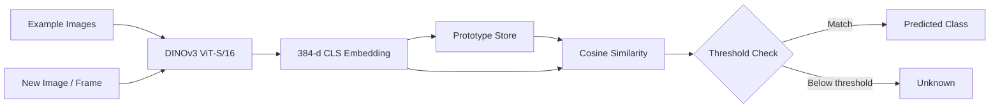

<div align="center">

# ProtoVision

### Self-Supervised Few-Shot Object Recognition with DINOv3

<p>
  <strong>Show it a few examples → build a prototype → recognize it live.</strong>
</p>

<p>
  No training loop · No fine-tuning · No GPU required
</p>

<p>
  
  
  
  
</p>

</div>

---

## 🧠 What is ProtoVision?

**ProtoVision** is a few-shot object recognition pipeline built around a **frozen DINOv3 ViT-S/16 backbone**.

Instead of training a classifier for every new object, ProtoVision:

1. Takes a handful of example images for an object.
2. Converts each image into a DINOv3 embedding.
3. Stores those embeddings as a **class prototype**.
4. Compares new observations using **cosine similarity**.
5. Can return an **"unknown"** result when similarity falls below the configured threshold.

The core idea is simple:

```text
   Example Images
         │
         ▼
┌─────────────────┐
│ Frozen DINOv3   │
│   ViT-S / 16    │
└────────┬────────┘
         │
         ▼
   384-d Embeddings
         │
         ▼
┌─────────────────┐
│ Class Prototype │
│   Storage       │
└────────┬────────┘
         │
         ▼
 New Image / Frame
         │
         ▼
┌─────────────────┐
│Cosine Similarity│
│ mean / max mode │
└────────┬────────┘
         │
         ▼
   Class / Unknown
```

---

## ✨ Project Highlights

| Capability | Description |
|---|---|
| 🧊 Frozen backbone | Uses DINOv3 without a training or fine-tuning loop |
| 🎯 Few-shot recognition | Learns a class from a handful of example images |
| 🧬 Prototype-based | Keeps example embeddings instead of requiring a trained classifier |
| 🔎 Flexible matching | Supports both `mean` and `max` matching modes |
| 🚫 Open-set fallback | Can return `unknown` when similarity is below the threshold |
| 💾 Persistent prototypes | Prototypes can be saved to and loaded from JSON |
| 🧪 Strong test coverage | Current test suite reports **56/56 passing** |
| 🖥️ CPU-oriented starting point | Designed to work without requiring a GPU for the tested pipeline |

---

## 📊 Current Development Status

> **Phase 1 — Steps 1–2 of 4 complete and tested**

| Step | Component | Status |
|:---:|---|:---:|
| **1** | `backbone.py` — frozen DINOv3 loading + embedding extraction | ✅ Complete |
| **2** | `prototypes.py` — prototype storage + `best_match()` | ✅ Complete |
| **3** | `capture.py` / `enroll.py` / `live.py` — camera applications | ⏳ Not started |
| **4** | CLI — `main.py enroll` / `main.py live` | ⏳ Not started |

---

## 🏗️ Architecture



### Core modules

```text
ProtoVision/
├── backbone.py        # DINOv3 loading + embedding extraction
├── prototypes.py      # Prototype storage + similarity matching
├── capture.py         # Camera capture (planned)
├── enroll.py          # Object enrollment (planned)
├── live.py            # Live recognition (planned)
├── main.py            # CLI entry point (planned)
├── tests/             # Automated tests
└── docs/
    └── DINOV3_SETUP.md
```

---

## 🧪 What Is Actually Tested?

ProtoVision separates the model-loading layer from the rest of the recognition logic so the core pipeline can be tested independently.

### ✅ Tested right now

**`prototypes.py`**

- Pure vector math + JSON I/O
- Adding examples
- Computing centroids
- `best_match()` in both `mean` and `max` modes
- Open-set `unknown` fallback
- Threshold edge cases
- Save/load round trips
- Atomic writes

**`backbone.py` pipeline**

- Resize-to-multiple-of-16 preprocessing
- ImageNet normalization
- BGR → RGB handling
- L2 normalization
- Output shape and dtype contract
- Batch embedding
- Gradient-free inference
- Compatibility with the expected DINOv3 interface:
  `forward_features(x)["x_norm_clstoken"]`
- Similarity sanity check between same-object and different-object crops

### ⚠️ Not yet validated in this environment

The following require the real DINOv3 weights and/or actual hardware:

- Real DINOv3 semantic quality on your own photos
- Camera FPS and inference latency on your Mac
- Practical comfort/size of the on-screen guide box

The current mock-model tests verify the **pipeline plumbing**, not the real-world semantic quality of DINOv3.

---

## 🧰 Setup

### 1. Create a virtual environment

```bash
python -m venv .venv
source .venv/bin/activate
```

### 2. Install dependencies

```bash
pip install -r requirements.txt
```

### 3. Install the real DINOv3 model

Follow:

```text
docs/DINOV3_SETUP.md
```

The DINOv3 weights are gated and need to be obtained manually on your machine.

---

## 🧪 Run the Test Suite

```bash
pytest tests/ -v
```

Current result:

```text
56 tests
56 passed
0 failed
```

No camera, GPU, or DINOv3 weights are required for the current automated test suite.

---

## 🔬 Design Decisions

### 1. Why `dinov3_vits16`?

The selected backbone is:

- **DINOv3 ViT-S/16**
- **21M parameters**
- **384-dimensional CLS token**
- Patch size: **16 × 16**

The project intentionally uses the confirmed `dinov3_vits16` model rather than silently substituting DINOv2.

### 2. Why store every example?

Prototype storage keeps **every example embedding**, rather than only a running mean.

That makes it possible to support:

- `mean` matching
- `max` / k-NN-style matching
- Future debugging such as identifying which stored example produced the strongest match

### 3. CPU frame-rate strategy

The planned live pipeline does **not** assume that the backbone must run on every camera frame.

A proposed approach is:

```text
Frame 1 ──► DINOv3 ──► Prediction A
Frame 2 ─────────────────► Hold A
Frame 3 ─────────────────► Hold A
Frame 4 ─────────────────► Hold A
Frame 5 ──► DINOv3 ──► Prediction B
```

A frame-skip value such as every 5th frame is only a starting point. Real inference latency will be measured on the target machine before tuning the final value.

---

## 🗺️ Roadmap

- [x] Build frozen DINOv3 embedding pipeline
- [x] Implement prototype storage
- [x] Implement similarity matching
- [x] Add open-set `unknown` fallback
- [x] Add automated tests
- [ ] Build camera capture flow
- [ ] Build object enrollment flow
- [ ] Build live recognition flow
- [ ] Add CLI commands
- [ ] Measure real CPU inference latency
- [ ] Tune frame-skipping strategy

---

## 📁 Documentation

The current project includes:

- `docs/DINOV3_SETUP.md` — instructions for obtaining and configuring the real DINOv3 weights

---

## ⚠️ Current Limitations

ProtoVision is currently at **Phase 1, Steps 1–2**.

The camera-based recognition experience and CLI have not been implemented yet, so the current repository should be understood as a **tested recognition core and embedding/prototype pipeline**, not a finished end-user camera application.

---

## 🔑 Core Idea

> **Don't train a new classifier for every object.**
>
> **Represent the object, store its examples, and compare future observations against those representations.**

---

<div align="center">

### ProtoVision

**Frozen backbone · Few-shot prototypes · Similarity-based recognition**

</div>
