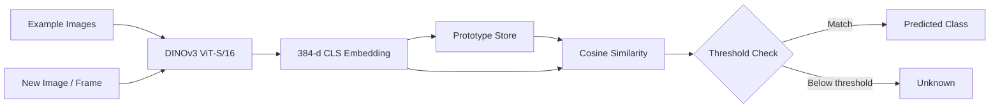

<div align="center">


<h2>🔬 Self-Supervised Few-Shot Object Recognition</h2>

</div>

<br>

<p>
  
  
  
  
</p>

<br>

<blockquote>
  <strong>Show a few examples.</strong> Build a prototype. <strong>Recognize unseen objects instantly.</strong>
</blockquote>

</div>

---

<div align="center">

### 🧩 The Core Idea

`Examples` → `DINOv3` → `Embeddings` → `Prototype` → `Cosine Similarity` → `Prediction`

</div>

---

## 🧠 What is ProtoVision?

**ProtoVision** is a few-shot object recognition pipeline built around a **frozen DINOv3 ViT-S/16 backbone**.

Instead of training a classifier for every new object, ProtoVision:

1. Takes a handful of example images for an object.
2. Converts each image into a DINOv3 embedding.
3. Stores those embeddings as a **class prototype**.
4. Compares new observations using **cosine similarity**.
5. Can return an **"unknown"** result when similarity falls below the configured threshold.

The core idea is simple:

```text
Example Images
      │
      ▼
┌─────────────────┐
│ Frozen DINOv3   │
│   ViT-S / 16    │
└────────┬────────┘
         │
         ▼
   384-d Embeddings
         │
         ▼
┌─────────────────┐
│ Class Prototype │
│   Storage       │
└────────┬────────┘
         │
         ▼
 New Image / Frame
         │
         ▼
┌─────────────────┐
│ Cosine Similarity│
│ mean / max mode │
└────────┬────────┘
         │
         ▼
   Class / Unknown
```

---

## ✨ Project Highlights

| Capability | Description |
|---|---|
| 🧊 Frozen backbone | Uses DINOv3 without a training or fine-tuning loop |
| 🎯 Few-shot recognition | Learns a class from a handful of example images |
| 🧬 Prototype-based | Keeps example embeddings instead of requiring a trained classifier |
| 🔎 Flexible matching | Supports both `mean` and `max` matching modes |
| 🚫 Open-set fallback | Can return `unknown` when similarity is below the threshold |
| 💾 Persistent prototypes | Prototypes can be saved to and loaded from JSON |
| 🧪 Strong test coverage | Current test suite reports **342/342 passing** |
| 🖥️ CPU-oriented starting point | Designed to work without requiring a GPU for the tested pipeline |

---

## 📊 Current Development Status

> **Phase 1 — all 4 steps complete and tested. Phase 2 — in progress.**

| Phase | Step | Component | Status |
|:---:|:---:|---|:---:|
| 1 | **1** | `backbone.py` — frozen DINOv3 loading + embedding extraction | ✅ Complete |
| 1 | **2** | `prototypes.py` — prototype storage + `best_match()` | ✅ Complete |
| 1 | **3** | `capture.py` / `enroll.py` / `live.py` — camera applications | ✅ Logic complete & tested · camera loop itself unverified (needs real hardware) |
| 1 | **4** | CLI — `main.py enroll` / `main.py live` / `main.py list` | ✅ Complete & tested · real enroll/live runs need real hardware + weights |
| 2 | **1** | `ui.py` — Poppins typography (glyph cache) + theme palettes | ✅ Complete & tested |
| 2 | **2** | `ui.py` — glass-panel HUD + cinematic vignette | ✅ Complete & tested |
| 2 | **3** | `ui.py` — similarity-meter signature visual | ✅ Complete & tested |
| 2 | **4** | HUD wired into `enroll.py`/`live.py` (panel + meter + vignette + theme key) | ✅ Complete & tested |
| 2 | **5** | Ambient audio + SFX (fail-soft) | ⏳ Not started |

---

## 🏗️ Architecture



### Core modules

```text
ProtoVision/
├── main.py             # CLI entry point (enroll / live / list)
├── protovision/
│   ├── backbone.py     # DINOv3 loading + embedding extraction
│   ├── prototypes.py   # Prototype storage + similarity matching
│   ├── capture.py      # Camera wrapper + guide-box geometry/crop
│   ├── enroll.py       # Object enrollment (capture → embed → save prototype)
│   ├── live.py         # Live recognition (frame-skip inference + best_match)
│   └── ui.py            # Visual design system: typography, themes, glass panels, vignette
├── assets/
│   └── fonts/           # Bundled Poppins (OFL-licensed) — Light/Regular/Medium/Bold
├── tests/              # Automated tests (342, all passing)
└── docs/
    └── DINOV3_SETUP.md
```

---

## 🖥️ Usage (CLI)

```bash
# Enroll a new object class — SPACE to capture, u to undo, Enter to finish
# early (once you've hit --min-examples), Esc to cancel
python main.py enroll --label mug

# with options
python main.py enroll --label mug --target-examples 10 --min-examples 6 --box-fraction 0.6

# Live recognition against everything enrolled so far — q or Esc to quit
python main.py live

# with options
python main.py live --threshold 0.6 --match-mode max --frame-skip 3

# See what's enrolled — reads the store only, no camera or backbone needed
python main.py list
```

`enroll`/`live` both need the real DINOv3 repo + weights in place first (see
`docs/DINOV3_SETUP.md`) — `list` doesn't, it just reads `data/prototypes.json`.
Every flag has a `--help`: `python main.py enroll --help`.

## 🧪 What Is Actually Tested?

ProtoVision separates the model-loading layer from the rest of the recognition logic so the core pipeline can be tested independently.

### ✅ Tested right now

**`prototypes.py`**

- Pure vector math + JSON I/O
- Adding examples
- Computing centroids
- `best_match()` in both `mean` and `max` modes
- Open-set `unknown` fallback
- Threshold edge cases
- Save/load round trips
- Atomic writes

**`backbone.py` pipeline**

- Resize-to-multiple-of-16 preprocessing
- ImageNet normalization
- BGR → RGB handling
- L2 normalization
- Output shape and dtype contract
- Batch embedding
- Gradient-free inference
- Compatibility with the expected DINOv3 interface:
  `forward_features(x)["x_norm_clstoken"]`
- Similarity sanity check between same-object and different-object crops

**`capture.py` geometry**

- Guide box centering, sizing (fraction of the shorter frame dimension),
  and clamping so it always fits inside the frame — including tiny/odd
  frame sizes
- Cropping math (correct region pulled, out-of-bounds boxes raise instead
  of silently corrupting)
- Overlay drawing never mutates the source frame

**`enroll.py` / `live.py` state machines**

- Full capture → embed → auto-finish-at-target flow, with `min_examples`
  enforced before a prototype can be saved
- Undo, cancel, and key-dispatch behavior (`handle_key`) in every state
- `live.py`'s frame-skip strategy specifically: verified with a call-counting
  backbone that inference only re-runs every `frame_skip`-th frame and the
  prediction is correctly held in between
- Real `__init__` logic (label stripping, default values, injected vs.
  auto-opened camera) exercised end-to-end with a fake in-memory camera
  standing in for hardware

**`main.py` CLI**

- Argument parsing: defaults, overrides, required flags, `choices=` validation
  (e.g. rejecting an invalid `--match-mode` or `--device`), and that shared
  flags (`--store`, `--device`, ...) work whether given before or after the
  subcommand
- `list` end-to-end (it needs neither a camera nor a backbone, so nothing's
  mocked there — it's tested exactly as it runs for real)
- `enroll`/`live` command wiring: correct arguments passed through to
  `EnrollApp`/`LiveApp`, success vs. cancelled exit codes, the "no classes
  enrolled yet" warning, and a clean `exit(1)` with a readable message
  instead of a raw traceback when DINOv3 isn't set up yet — all via a fake
  backbone/app, since the real ones need actual hardware

**`ui.py` typography + themes** — tested against the REAL bundled Poppins
font files, not a mock (no gating/licensing issue for a Google Font, so no
reason to fake it):

- Font loading, per-character advance widths, and `measure_text()` against
  all four bundled weights
- Glyph caching: repeated lookups return the identical cached object (proven
  via `is`, not just equal values); different color/size produce genuinely
  different cache entries; BGR color is applied correctly (checked by
  inspecting actual rendered pixel values, not just trusting the code path)
- **The strong one:** `draw_text()`'s output is compared PIXEL-BY-PIXEL
  against a direct, one-shot PIL render of the same string, across several
  strings/sizes/weights. This caught a real bug during development — summing
  pre-rounded per-character advances let rounding error accumulate and
  visibly drift the cursor on longer strings (a few px by the end of
  `"ProtoVision"`). Fixed by accumulating unrounded advances and rounding
  only once per glyph at blit time; now within ±1 pixel per channel almost
  everywhere.
- Out-of-bounds text (partially off any edge, negative position) doesn't crash
- Theme palette validity (every color is a real BGR triple, alpha/vignette
  values in `[0, 1]`) and the theme-cycling state machine, including the
  `T`-key handler and wraparound

**`ui.py` glass-panel HUD + vignette**

- Rounded-rect + gradient + border + shadow math tested at every layer, not
  just the final composited output: the anti-aliased corner mask, the
  border-ring mask (outer minus an inset inner mask), the vertical gradient
  (top/bottom colors, monotonic transition), and the lighten/darken color
  helpers that derive the gradient from a single theme color
- Panel alpha at the exact center matches `theme.panel_fill_alpha`; alpha at
  the true corner is near-zero (rounded away); border pixels are visibly
  distinct from the plain fill only when `border_width > 0`
- Shadow: tinted with `theme.shadow`, strength-scaled (0 → fully transparent,
  confirmed by checking `alpha.max() == 0`), and rendered oversized so the
  blur has visible falloff rather than a hard-cut edge
- `draw_glass_panel()` composited onto frames via the same `_blit_bgra` used
  for text (one tested compositing primitive, not two), including a
  parametrized test that a panel positioned off *every* edge (negative x/y,
  hanging past the right/bottom) doesn't crash and leaves far-away pixels
  untouched
- Vignette: strength `0` is a byte-for-byte no-op, strength `1` drives the
  corners near-black while the center barely moves, darkening is monotonic
  in strength, and `apply_theme_vignette()` is checked to produce output
  identical to calling `apply_vignette()` with that theme's own strength
  directly — not just "close", exactly equal
- Before writing any of these tests, every theme's panel+text+vignette combo
  was actually rendered to PNG and looked at (not just asserted on) to catch
  anything that was numerically fine but visually wrong first — see design
  decision #8 below

**`ui.py` similarity meter** — the signature visual: a horizontal bar per
known class showing its live cosine similarity, so the actual ML decision is
visible rather than just the winning label

- `prototypes.py` grew a companion method for this, `all_similarities()` —
  `best_match()` only ever returned the single winner, which isn't enough to
  draw a bar per class. Tested for agreement with `best_match()` (the
  highest-scoring label in `all_similarities()` is always the same label
  `best_match()` returns, in both `mean` and `max` mode) plus its own edge
  cases (empty store, single class)
- Bar fill is verified by counting pixels that actually match the accent
  color, not just "differs from the background" — the background track pill
  also differs from the background at its full width regardless of fill
  amount, so an early version of this test was accidentally passing for the
  wrong reason (see design decision #10) until it was rewritten to check the
  right thing
- Confirmed a higher similarity produces measurably more filled pixels than
  a lower one, that bars at/above `threshold` render in `theme.accent_known`
  and below it in `theme.accent_unknown`, and that a similarity below zero
  (a real possibility for cosine similarity, not just a theoretical one)
  still shows a partial bar rather than an empty/invisible one
- Long class-name labels are truncated with a real ellipsis glyph
  (confirmed Poppins actually has one, rather than assuming) so they can't
  run into the bar; truncation is tested both in isolation (does the
  shortened text actually measure within the target width) and integrated
  (does a very long label just work, not crash)
- Row order: entries are drawn in the exact order passed in, not
  auto-sorted by score — tested explicitly, since silently sorting would be
  a very easy "helpful" bug to introduce later without noticing
- Rendered and visually checked (all four themes, several labels including
  a long one, edge-clipped positions) before the tests above were written,
  same workflow as the panel work

**HUD wired into `enroll.py`/`live.py`** — the panel, vignette, and meter
stopped being tested-but-unused `ui.py` functions and became the apps'
actual `render_preview()`

- Caught a real layout bug before writing any tests for this piece: the
  enroll screen's key-hint line measured 376px wide against a 260px panel —
  badly overflowing. Rendered it, saw the overflow, fixed it (split into two
  lines, widened the panel to 280px), re-rendered to confirm, then wrote
  tests against the corrected layout
- `live.py`'s `process_frame()` now caches `all_similarities()` alongside
  `best_match()` on the same frame-skip schedule, so the meter and the
  headline prediction can never disagree about which frame they're
  describing — tested by confirming `last_similarities` is held (identical
  object, not recomputed) on skipped frames, same proof-by-identity used for
  the frame-skip logic itself back in Phase 1
- `live.py`'s panel falls back to a distinct message for each of three
  states — no classes enrolled, classes enrolled but no inference has run
  yet, and an active result — tested separately so "empty store" and
  "haven't inferred yet" can't be silently confused with each other
- `T` (theme cycling) is handled in both apps: tested that it actually
  changes `theme_manager.name`, that it works in `enroll.py` even after the
  session is `DONE`/`CANCELLED` (there's no reason switching themes should
  be gated behind capture state), and that it doesn't accidentally also
  trigger capture/undo/finish/cancel on the same keypress
- Two themes rendering the same state are asserted to produce genuinely
  different output — proves the HUD is actually reading
  `self.theme_manager.theme`, not a hardcoded palette that happens to match
  the tests
- Visually verified across both apps, several themes, and every live-view
  state (empty, waiting, known match, unknown match) before any of the
  above assertions were written

### ⚠️ Not yet validated in this environment

The following require the real DINOv3 weights and/or actual hardware:

- Real DINOv3 semantic quality on your own photos
- Camera FPS and inference latency on your Mac
- Practical comfort/size of the on-screen guide box
- The actual `run()` camera loops in `enroll.py`/`live.py` — the OpenCV
  window, live keypresses, and real-time overlay rendering. Every piece of
  *logic* those loops call (`handle_key`, `capture_example`,
  `process_frame`, `render_preview`, ...) is tested; the thin loop that
  wires them to a real window and a real camera isn't, and can't be from
  here.
- Running `python main.py enroll`/`python main.py live` for real — the CLI's
  own argument parsing and dispatch logic is tested (see above), but an
  actual end-to-end run needs the real backbone and a webcam, neither of
  which exist in this sandbox.
- Whether the typography/panel/vignette/meter system actually looks good composited
  over a live, MOVING camera feed rather than a static synthetic test frame or
  a rendered-to-PNG snapshot — every theme was visually checked as a still
  image (see design decision #8), but motion, real lighting, and a real
  background are a different test this sandbox still can't run.

The current mock-model tests verify the **pipeline plumbing**, not the real-world semantic quality of DINOv3.

---

## 🧰 Setup

### 1. Create a virtual environment

```bash
python -m venv .venv
source .venv/bin/activate
```

### 2. Install dependencies

```bash
pip install -r requirements.txt
```

### 3. Install the real DINOv3 model

Follow:

```text
docs/DINOV3_SETUP.md
```

The DINOv3 weights are gated and need to be obtained manually on your machine.

---

## 🧪 Run the Test Suite

```bash
pytest tests/ -v
```

Current result:

```text
342 tests
342 passed
0 failed
```

No camera, GPU, or DINOv3 weights are required for the current automated test suite.

---

## 🔬 Design Decisions

### 1. Why `dinov3_vits16`?

The selected backbone is:

- **DINOv3 ViT-S/16**
- **21M parameters**
- **384-dimensional CLS token**
- Patch size: **16 × 16**

The project intentionally uses the confirmed `dinov3_vits16` model rather than silently substituting DINOv2.

### 2. Why store every example?

Prototype storage keeps **every example embedding**, rather than only a running mean.

That makes it possible to support:

- `mean` matching
- `max` / k-NN-style matching
- Future debugging such as identifying which stored example produced the strongest match

### 3. CPU frame-rate strategy

The planned live pipeline does **not** assume that the backbone must run on every camera frame.

A proposed approach is:

```text
Frame 1 ──► DINOv3 ──► Prediction A
Frame 2 ─────────────────► Hold A
Frame 3 ─────────────────► Hold A
Frame 4 ─────────────────► Hold A
Frame 5 ──► DINOv3 ──► Prediction B
```

A frame-skip value such as every 5th frame is only a starting point. Real inference latency will be measured on the target machine before tuning the final value.

### 4. Testing camera-dependent code without a camera

`enroll.py` and `live.py` each open a real `Camera` as the very last step of
`__init__`. To keep them testable anyway:

- Every method containing actual *logic* (key handling, capture bookkeeping,
  frame-skip inference, guide-box rendering) only touches `self`'s plain
  attributes, never the camera directly — so it can be tested by
  constructing the object via `__new__` (skipping `__init__` entirely) and
  setting just those attributes.
- `__init__`'s own logic (argument validation, label stripping, defaults,
  camera injection) is tested separately by monkeypatching `Camera` with a
  no-op `FakeCamera` and going through the real constructor.
- Only the actual `run()` loop — the part that opens an OpenCV window and
  blocks on live keypresses — is left untested, since that genuinely needs
  a display and a webcam.

### 5. Testing the CLI without a camera or real weights

`main.py`'s `enroll`/`live` commands ultimately call `load_default_backbone()`
and construct a real `EnrollApp`/`LiveApp`, both of which need hardware this
sandbox doesn't have. So the CLI is tested one layer up: `load_default_backbone`,
`EnrollApp`, and `LiveApp` are monkeypatched with fakes for the dispatch tests
(`cmd_enroll`/`cmd_live`), which verifies argument wiring, exit codes, and the
"no classes enrolled" warning without touching hardware. `cmd_list` needs
neither a camera nor a backbone at all, so it's tested exactly as it runs for
real. Argument *parsing* (`build_parser()`) is tested directly with no mocking
needed, since it's pure `argparse` logic.

### 6. Why bundle Poppins directly instead of asking you to copy it over

Poppins is a Google Font under the SIL Open Font License, which explicitly
allows redistribution — so rather than have you manually copy the `.ttf`
files over from SignSense's assets before anything in `ui.py` would even
load, the four static weights that exist for Poppins (Light/Regular/Medium/
Bold — there's no separate SemiBold/ExtraBold release for this font) are
committed straight into `assets/fonts/`. `assets/fonts/NOTICE.md` explains
the license and how to add more weights from your own assets if you want
them later.

### 7. Why glyphs are cached per-character, not per-string

The brief calls for caching "text patches" rather than re-rendering every
frame — but a naive per-*string* cache (`"87.3%"` → bitmap) doesn't actually
help here, because the similarity meter's whole point is showing a number
that changes essentially every frame; a new string means a cache miss every
time regardless. Caching per-*character* instead means every possible string
is built from a small, stable alphabet of glyphs that gets reused
indefinitely — `"87.3%"` and `"12.9%"` share almost every glyph. `draw_text()`
composites cached glyphs left-to-right rather than asking PIL to rasterize
the whole string fresh each call.

### 8. Rendering to PNG and actually looking, before writing assertions

Numeric assertions can all pass while the thing still looks wrong — off-by-one
padding, a shadow rendered on the wrong side, a gradient direction flipped.
So for both the typography work and the glass-panel/vignette work, the
process was: render real output to PNG first, actually look at it, *then*
write tests against the behavior confirmed correct. This is how the
cumulative-rounding drift in `draw_text()` (design note in the typography
section above) got caught — a pixel-diff test against direct PIL rendering
made the drift impossible to miss, rather than a looser test that would have
passed anyway. Every theme's glass panel + text + vignette was rendered and
visually checked before any test in `TestRenderGlassPanel`/`TestApplyVignette`
was written.

### 9. Panels and text share one compositing primitive

`draw_glass_panel()` and `draw_text()` both end up calling the same
`_blit_bgra()` — build a self-contained BGRA patch (glyph, panel, or shadow),
then alpha-composite it onto the frame with edge-clipping. One tested
blending/clipping code path for the whole HUD, rather than a second bespoke
one for panels that could drift out of sync or have its own edge-case bugs.
The similarity meter's bars (`_solid_rounded_rect`) reuse the same
`_rounded_rect_mask` the panels use, for the same reason.

### 10. A test that passed for the wrong reason

Worth writing down since it's a real mistake, not a hypothetical one: the
first version of `test_higher_similarity_fills_more_of_the_bar` compared "how
many pixels differ from the plain background" between a low-similarity and a
high-similarity render, expecting the fuller bar to change more pixels. It
failed — both counts came out identical. The bug was in the test, not the
code: the background *track* (the dim pill every bar sits on, regardless of
fill amount) already differs from the background across its *entire* width,
so that metric was blind to how much of it was actually filled. Fixed by
counting pixels that match the accent (fill) color specifically. Flagging
this because a looser version of that test would have quietly passed either
way and told me nothing.

### 11. Wiring the HUD in caught a real overflow bug

`enroll.py`'s key-hint line — `"SPACE capture   U undo   ENTER finish   ESC
cancel   T theme"` — measured 376px wide against a 260px-wide panel once
actually rendered. The panel/text primitives themselves were already tested
and correct; this was purely an integration-layer mistake (nobody had
checked whether a *specific* string fit in a *specific* panel at a *specific*
font size). Caught by rendering before writing tests, same as design
decisions #8 and #10 — fixed by splitting the hint across two lines and
widening the panel to 280px, then re-verified visually before locking in
assertions. Noted here because it's a good example of why "the pieces are
individually tested" doesn't automatically mean "the assembled screen is
correct" — integration gets its own visual check every time, not just unit
coverage.

### 12. Similarity meter and prediction can't disagree about the frame

`live.py`'s `process_frame()` computes `best_match()` and
`all_similarities()` from the *same* embedding, on the *same* frame-skip
schedule — never two separate calls that could end up looking at different
frames. Concretely: `last_similarities` is a held reference (not
recomputed) on skipped frames, exactly like `last_result` already was, so
the headline prediction and the bar chart underneath it are guaranteed to
be describing the same instant, not subtly out of sync.

---

## 🗺️ Roadmap

- [x] Build frozen DINOv3 embedding pipeline
- [x] Implement prototype storage
- [x] Implement similarity matching
- [x] Add open-set `unknown` fallback
- [x] Add automated tests
- [x] Build camera capture flow (guide-box geometry, cropping, overlay)
- [x] Build object enrollment flow (capture/undo/finish/cancel state machine)
- [x] Build live recognition flow (frame-skip inference)
- [x] Add CLI commands (`enroll` / `live` / `list`)
- [x] Build Poppins typography system with glyph caching
- [x] Build theme palette system (dark/light/neon/mono) with `T`-key cycling
- [x] Build glass-panel HUD + cinematic vignette
- [x] Build the similarity-meter signature visual
- [x] Wire panel + vignette + meter + theme cycling into enroll.py/live.py's actual HUD
- [ ] Add ambient audio + SFX (fail-soft)
- [ ] Measure real CPU inference latency
- [ ] Tune frame-skipping strategy

---

## 📁 Documentation

The current project includes:

- `docs/DINOV3_SETUP.md` — instructions for obtaining and configuring the real DINOv3 weights

---

## ⚠️ Current Limitations

**Phase 1 is complete.** All four steps — backbone, prototype storage,
camera-app logic, and CLI — are built and unit tested (342/342 passing).
**Phase 2 is nearly done:** typography, themes, glass-panel HUD, vignette,
and the similarity meter are all built, tested, and now actually wired into
`enroll.py`/`live.py`'s real `render_preview()` — not just standalone
functions in `ui.py` anymore. Only ambient audio/SFX is left.

What hasn't happened yet, and can't happen from this sandbox:

- The real DINOv3 repo + weights haven't been loaded and run for real (gated,
  requires your machine — see `docs/DINOV3_SETUP.md`)
- `python main.py enroll` / `python main.py live` haven't been run
  end-to-end against a real webcam
- No real-world semantic-quality check yet (same object → higher similarity
  than a different object, on actual photos rather than the mock model)
- No check of the typography/panel/vignette/meter system composited over a live,
  MOVING camera feed with a real background — every theme, and both apps'
  full HUD, was rendered and visually confirmed as a still PNG (see design
  decisions #8, #10, and #11), which is a real check, just not the same one
  as watching it run live

Once the Phase 1 hardware checks pass on your machine and audio (the last
piece of Phase 2) is built, this becomes the finished portfolio piece
described in the original brief.

---

## 🔑 Core Idea

> **Don't train a new classifier for every object.**
>
> **Represent the object, store its examples, and compare future observations against those representations.**

---

<div align="center">

### ProtoVision

**Frozen backbone · Few-shot prototypes · Similarity-based recognition**

</div>
