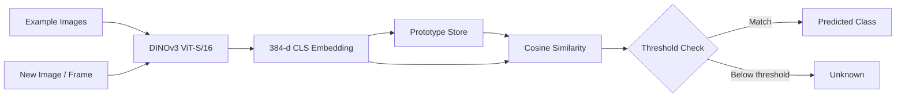

<div align="center">


<h2>🔬 Self-Supervised Few-Shot Object Recognition</h2>

</div>

<br>

<p>
  
  
  
  
</p>

<br>

<blockquote>
  <strong>Show a few examples.</strong> Build a prototype. <strong>Recognize unseen objects instantly.</strong>
</blockquote>

</div>

---

<div align="center">

### 🧩 The Core Idea

`Examples` → `DINOv3` → `Embeddings` → `Prototype` → `Cosine Similarity` → `Prediction`

</div>

---

## 🧠 What is ProtoVision?

**ProtoVision** is a few-shot object recognition pipeline built around a **frozen DINOv3 ViT-S/16 backbone**.

Instead of training a classifier for every new object, ProtoVision:

1. Takes a handful of example images for an object.
2. Converts each image into a DINOv3 embedding.
3. Stores those embeddings as a **class prototype**.
4. Compares new observations using **cosine similarity**.
5. Can return an **"unknown"** result when similarity falls below the configured threshold.

The core idea is simple:

```text
Example Images
      │
      ▼
┌─────────────────┐
│ Frozen DINOv3   │
│   ViT-S / 16    │
└────────┬────────┘
         │
         ▼
   384-d Embeddings
         │
         ▼
┌─────────────────┐
│ Class Prototype │
│   Storage       │
└────────┬────────┘
         │
         ▼
 New Image / Frame
         │
         ▼
┌─────────────────┐
│ Cosine Similarity│
│ mean / max mode │
└────────┬────────┘
         │
         ▼
   Class / Unknown
```

---

## ✨ Project Highlights

| Capability | Description |
|---|---|
| 🧊 Frozen backbone | Uses DINOv3 without a training or fine-tuning loop |
| 🎯 Few-shot recognition | Learns a class from a handful of example images |
| 🧬 Prototype-based | Keeps example embeddings instead of requiring a trained classifier |
| 🔎 Flexible matching | Supports both `mean` and `max` matching modes |
| 🚫 Open-set fallback | Can return `unknown` when similarity is below the threshold |
| 💾 Persistent prototypes | Prototypes can be saved to and loaded from JSON |
| 🧪 Strong test coverage | Current test suite reports **556/556 passing** |
| 🖥️ CPU-oriented starting point | Designed to work without requiring a GPU for the tested pipeline |

---

## 📊 Current Development Status

> **Phase 1 — all 4 steps complete and tested. Phase 2 — all 5 steps complete and tested. Phase 3 — all 4 pick-a-few enrichments complete and tested.**

| Phase | Step | Component | Status |
|:---:|:---:|---|:---:|
| 1 | **1** | `backbone.py` — frozen DINOv3 loading + embedding extraction | ✅ Complete |
| 1 | **2** | `prototypes.py` — prototype storage + `best_match()` | ✅ Complete |
| 1 | **3** | `capture.py` / `enroll.py` / `live.py` — camera applications | ✅ Logic complete & tested · camera loop itself unverified (needs real hardware) |
| 1 | **4** | CLI — `main.py enroll` / `main.py live` / `main.py list` | ✅ Complete & tested · real enroll/live runs need real hardware + weights |
| 2 | **1** | `ui.py` — Poppins typography (glyph cache) + theme palettes | ✅ Complete & tested |
| 2 | **2** | `ui.py` — glass-panel HUD + cinematic vignette | ✅ Complete & tested |
| 2 | **3** | `ui.py` — similarity-meter signature visual | ✅ Complete & tested |
| 2 | **4** | HUD wired into `enroll.py`/`live.py` (panel + meter + vignette + theme key) | ✅ Complete & tested |
| 2 | **5** | `audio.py` — fail-soft SFX + ambient audio, wired into enroll/live | ✅ Complete & tested |
| 3 | **1** | Open-set polish — sustained "New object? Press N" prompt + live→enroll→live handoff | ✅ Complete & tested |
| 3 | **2** | Match debugging (which stored example matched + noisy/confusable-enrollment warnings) | ✅ Complete & tested |
| 3 | **3** | Export/import a shareable "recognizer pack" file | ✅ Complete & tested |
| 3 | **4** | CPU latency benchmark script | ✅ Complete & tested |

---

## 🏗️ Architecture



### Core modules

```text
ProtoVision/
├── main.py             # CLI entry point (enroll / live / list / export / import / benchmark)
├── protovision/
│   ├── backbone.py     # DINOv3 loading + embedding extraction
│   ├── prototypes.py   # Prototype storage + similarity matching
│   ├── capture.py      # Camera wrapper + guide-box geometry/crop
│   ├── enroll.py       # Object enrollment (capture → embed → save prototype)
│   ├── live.py         # Live recognition (frame-skip inference + best_match)
│   ├── ui.py            # Visual design system: typography, themes, glass panels, vignette, similarity meter
│   ├── audio.py          # Fail-soft SFX + ambient audio (pygame)
│   ├── pack.py            # Export/import a shareable "recognizer pack"
│   └── benchmark.py        # CPU inference-latency benchmark + frame_skip suggestions
├── assets/
│   ├── fonts/            # Bundled Poppins (OFL-licensed) — Light/Regular/Medium/Bold
│   └── audio/
│       ├── sfx/           # enroll_success.wav, match_found.wav
│       └── music/         # ambient_pad.wav
├── tests/              # Automated tests (556, all passing)
└── docs/
    └── DINOV3_SETUP.md
```

---

## 🖥️ Usage (CLI)

```bash
# Enroll a new object class — SPACE to capture, u to undo, Enter to finish
# early (once you've hit --min-examples), Esc to cancel
python main.py enroll --label mug

# with options
python main.py enroll --label mug --target-examples 10 --min-examples 6 --box-fraction 0.6

# Live recognition against everything enrolled so far — q or Esc to quit
python main.py live

# with options
python main.py live --threshold 0.6 --match-mode max --frame-skip 3

# T cycles the theme (dark/light/neon/mono) in either command, live too

# During live recognition, once an object has stayed unrecognized long
# enough the HUD offers "New object? Press N" — pressing N drops straight
# into an enrollment session for it (same process, same loaded backbone),
# then automatically resumes live recognition afterward

# Disable audio entirely (SFX + ambient) — audio already fails silently on
# its own if pygame or a device isn't available, --mute is for explicitly
# turning it off regardless
python main.py live --mute

# See what's enrolled — reads the store only, no camera or backbone needed
python main.py list

# Export enrolled classes as a shareable "recognizer pack" file — everything
# by default, or just the classes you name
python main.py export my_pack.json
python main.py export my_pack.json --label mug --label bottle

# Preview a pack's contents without importing anything
python main.py import my_pack.json --info

# Import a pack's classes into your current store. A class that already
# exists locally is skipped by default — --on-conflict merge appends the
# pack's examples to it instead, --on-conflict overwrite replaces it
python main.py import my_pack.json
python main.py import my_pack.json --on-conflict merge

# Measure DINOv3 embedding latency on this machine and get a concrete
# --frame-skip suggestion for `live` — needs the real backbone, same as
# enroll/live
python main.py benchmark
python main.py benchmark --runs 100 --image-size 224
```

`enroll`/`live`/`benchmark` all need the real DINOv3 repo + weights in
place first (see `docs/DINOV3_SETUP.md`) — `list`/`export`/`import` don't,
they just read/write `data/prototypes.json` or a pack file.
Every flag has a `--help`: `python main.py enroll --help`.

## 🧪 What Is Actually Tested?

ProtoVision separates the model-loading layer from the rest of the recognition logic so the core pipeline can be tested independently.

### ✅ Tested right now

**`prototypes.py`**

- Pure vector math + JSON I/O
- Adding examples
- Computing centroids
- `best_match()` in both `mean` and `max` modes
- Open-set `unknown` fallback
- Threshold edge cases
- Save/load round trips
- Atomic writes

**`backbone.py` pipeline**

- Resize-to-multiple-of-16 preprocessing
- ImageNet normalization
- BGR → RGB handling
- L2 normalization
- Output shape and dtype contract
- Batch embedding
- Gradient-free inference
- Compatibility with the expected DINOv3 interface:
  `forward_features(x)["x_norm_clstoken"]`
- Similarity sanity check between same-object and different-object crops

**`capture.py` geometry**

- Guide box centering, sizing (fraction of the shorter frame dimension),
  and clamping so it always fits inside the frame — including tiny/odd
  frame sizes
- Cropping math (correct region pulled, out-of-bounds boxes raise instead
  of silently corrupting)
- Overlay drawing never mutates the source frame

**`enroll.py` / `live.py` state machines**

- Full capture → embed → auto-finish-at-target flow, with `min_examples`
  enforced before a prototype can be saved
- Undo, cancel, and key-dispatch behavior (`handle_key`) in every state
- `live.py`'s frame-skip strategy specifically: verified with a call-counting
  backbone that inference only re-runs every `frame_skip`-th frame and the
  prediction is correctly held in between
- Real `__init__` logic (label stripping, default values, injected vs.
  auto-opened camera) exercised end-to-end with a fake in-memory camera
  standing in for hardware

**`main.py` CLI**

- Argument parsing: defaults, overrides, required flags, `choices=` validation
  (e.g. rejecting an invalid `--match-mode` or `--device`), and that shared
  flags (`--store`, `--device`, ...) work whether given before or after the
  subcommand
- `list` end-to-end (it needs neither a camera nor a backbone, so nothing's
  mocked there — it's tested exactly as it runs for real)
- `enroll`/`live` command wiring: correct arguments passed through to
  `EnrollApp`/`LiveApp`, success vs. cancelled exit codes, the "no classes
  enrolled yet" warning, and a clean `exit(1)` with a readable message
  instead of a raw traceback when DINOv3 isn't set up yet — all via a fake
  backbone/app, since the real ones need actual hardware

**`ui.py` typography + themes** — tested against the REAL bundled Poppins
font files, not a mock (no gating/licensing issue for a Google Font, so no
reason to fake it):

- Font loading, per-character advance widths, and `measure_text()` against
  all four bundled weights
- Glyph caching: repeated lookups return the identical cached object (proven
  via `is`, not just equal values); different color/size produce genuinely
  different cache entries; BGR color is applied correctly (checked by
  inspecting actual rendered pixel values, not just trusting the code path)
- **The strong one:** `draw_text()`'s output is compared PIXEL-BY-PIXEL
  against a direct, one-shot PIL render of the same string, across several
  strings/sizes/weights. This caught a real bug during development — summing
  pre-rounded per-character advances let rounding error accumulate and
  visibly drift the cursor on longer strings (a few px by the end of
  `"ProtoVision"`). Fixed by accumulating unrounded advances and rounding
  only once per glyph at blit time; now within ±1 pixel per channel almost
  everywhere.
- Out-of-bounds text (partially off any edge, negative position) doesn't crash
- Theme palette validity (every color is a real BGR triple, alpha/vignette
  values in `[0, 1]`) and the theme-cycling state machine, including the
  `T`-key handler and wraparound

**`ui.py` glass-panel HUD + vignette**

- Rounded-rect + gradient + border + shadow math tested at every layer, not
  just the final composited output: the anti-aliased corner mask, the
  border-ring mask (outer minus an inset inner mask), the vertical gradient
  (top/bottom colors, monotonic transition), and the lighten/darken color
  helpers that derive the gradient from a single theme color
- Panel alpha at the exact center matches `theme.panel_fill_alpha`; alpha at
  the true corner is near-zero (rounded away); border pixels are visibly
  distinct from the plain fill only when `border_width > 0`
- Shadow: tinted with `theme.shadow`, strength-scaled (0 → fully transparent,
  confirmed by checking `alpha.max() == 0`), and rendered oversized so the
  blur has visible falloff rather than a hard-cut edge
- `draw_glass_panel()` composited onto frames via the same `_blit_bgra` used
  for text (one tested compositing primitive, not two), including a
  parametrized test that a panel positioned off *every* edge (negative x/y,
  hanging past the right/bottom) doesn't crash and leaves far-away pixels
  untouched
- Vignette: strength `0` is a byte-for-byte no-op, strength `1` drives the
  corners near-black while the center barely moves, darkening is monotonic
  in strength, and `apply_theme_vignette()` is checked to produce output
  identical to calling `apply_vignette()` with that theme's own strength
  directly — not just "close", exactly equal
- Before writing any of these tests, every theme's panel+text+vignette combo
  was actually rendered to PNG and looked at (not just asserted on) to catch
  anything that was numerically fine but visually wrong first — see design
  decision #8 below

**`ui.py` similarity meter** — the signature visual: a horizontal bar per
known class showing its live cosine similarity, so the actual ML decision is
visible rather than just the winning label

- `prototypes.py` grew a companion method for this, `all_similarities()` —
  `best_match()` only ever returned the single winner, which isn't enough to
  draw a bar per class. Tested for agreement with `best_match()` (the
  highest-scoring label in `all_similarities()` is always the same label
  `best_match()` returns, in both `mean` and `max` mode) plus its own edge
  cases (empty store, single class)
- Bar fill is verified by counting pixels that actually match the accent
  color, not just "differs from the background" — the background track pill
  also differs from the background at its full width regardless of fill
  amount, so an early version of this test was accidentally passing for the
  wrong reason (see design decision #10) until it was rewritten to check the
  right thing
- Confirmed a higher similarity produces measurably more filled pixels than
  a lower one, that bars at/above `threshold` render in `theme.accent_known`
  and below it in `theme.accent_unknown`, and that a similarity below zero
  (a real possibility for cosine similarity, not just a theoretical one)
  still shows a partial bar rather than an empty/invisible one
- Long class-name labels are truncated with a real ellipsis glyph
  (confirmed Poppins actually has one, rather than assuming) so they can't
  run into the bar; truncation is tested both in isolation (does the
  shortened text actually measure within the target width) and integrated
  (does a very long label just work, not crash)
- Row order: entries are drawn in the exact order passed in, not
  auto-sorted by score — tested explicitly, since silently sorting would be
  a very easy "helpful" bug to introduce later without noticing
- Rendered and visually checked (all four themes, several labels including
  a long one, edge-clipped positions) before the tests above were written,
  same workflow as the panel work

**HUD wired into `enroll.py`/`live.py`** — the panel, vignette, and meter
stopped being tested-but-unused `ui.py` functions and became the apps'
actual `render_preview()`

- Caught a real layout bug before writing any tests for this piece: the
  enroll screen's key-hint line measured 376px wide against a 260px panel —
  badly overflowing. Rendered it, saw the overflow, fixed it (split into two
  lines, widened the panel to 280px), re-rendered to confirm, then wrote
  tests against the corrected layout
- `live.py`'s `process_frame()` now caches `all_similarities()` alongside
  `best_match()` on the same frame-skip schedule, so the meter and the
  headline prediction can never disagree about which frame they're
  describing — tested by confirming `last_similarities` is held (identical
  object, not recomputed) on skipped frames, same proof-by-identity used for
  the frame-skip logic itself back in Phase 1
- `live.py`'s panel falls back to a distinct message for each of three
  states — no classes enrolled, classes enrolled but no inference has run
  yet, and an active result — tested separately so "empty store" and
  "haven't inferred yet" can't be silently confused with each other
- `T` (theme cycling) is handled in both apps: tested that it actually
  changes `theme_manager.name`, that it works in `enroll.py` even after the
  session is `DONE`/`CANCELLED` (there's no reason switching themes should
  be gated behind capture state), and that it doesn't accidentally also
  trigger capture/undo/finish/cancel on the same keypress
- Two themes rendering the same state are asserted to produce genuinely
  different output — proves the HUD is actually reading
  `self.theme_manager.theme`, not a hardcoded palette that happens to match
  the tests
- Visually verified across both apps, several themes, and every live-view
  state (empty, waiting, known match, unknown match) before any of the
  above assertions were written

**`audio.py` fail-soft SFX + ambient audio**

- Two layers of testing, deliberately: fail-soft LOGIC (caching, name
  dispatch, error handling, volume clamping) is tested against a fake
  pygame double via monkeypatch — same pattern as `FakeCamera` for
  enroll.py/live.py — so it's fast and doesn't depend on any audio
  subsystem actually working here. Separately, a small integration check
  loads the REAL bundled `.wav` files through REAL pygame using SDL's
  `dummy` audio driver (no physical device needed), the same
  confidence-building step used for the real Poppins fonts
- Construction never raises regardless of what fails — pygame not
  installed, `mixer.init()` erroring (no audio device), a specific sound
  file missing — tested for each failure mode individually, plus a test
  that explicitly asserts construction doesn't raise even when everything
  about audio is broken
- Sound loading is cached (loaded once, played many times — verified by
  counting `Sound()` construction calls, not just checking playback
  worked) and load/playback exceptions are caught without propagating
- **The threshold-crossing chime logic specifically** (this is the part
  with real behavior to get right, not just plumbing): a `SequenceBackbone`
  test double feeds `process_frame()` a scripted sequence of embeddings, so
  tests can assert the exact call count of the `match_found` chime across
  unknown→known, known→known (same class, must NOT re-fire), known→unknown
  (must NOT fire — only entering a match triggers it), known→known-but-a-
  DIFFERENT-class (must fire again), and confirms the chime decision only
  evaluates on frames where inference actually ran, not held/skipped ones
- `enroll.py`'s `finish()` is confirmed to play `enroll_success` exactly
  once on a successful finish, zero times if `finish()` raises for too few
  examples, and exactly once whether reached via an explicit finish key or
  via `capture_example()` auto-finishing at the target count
- `main.py`'s `--mute` flag and the ambient-audio start/stop lifecycle
  around `live.py`'s `run()` are tested at the CLI dispatch level too,
  including that `stop_ambient()` still fires even if `run()` raises (it's
  in a `finally` block) — the ambient loop shouldn't be left playing
  forever just because the camera loop crashed

**Phase 3, step 1: open-set polish**

- `unknown_streak` increments only on real inferences (not held/skipped
  frames), resets to zero the instant a known match appears, and
  `wants_to_teach` flips true only once the streak is sustained — not on a
  single low-confidence blip
- The `N` key is a no-op unless `wants_to_teach` is already true — tested
  explicitly so pressing it during a normal "unknown" moment, or during a
  known match, can't accidentally queue up teaching whatever happened to be
  in the box a second ago
- The rendered HUD is confirmed to actually differ between "plain unknown"
  and "sustained unknown, showing the teach prompt" for the *same*
  underlying match result — proving the visual state change is real, not
  just the internal flag
- `main.py`'s live↔enroll handoff loop is tested at the CLI dispatch level
  with a scripted sequence of `LiveExitReason`s (QUIT immediately / TEACH →
  QUIT / TEACH with a blank label → cancel → resume): confirms the label
  prompt is asked, a blank answer skips enrollment without constructing an
  `EnrollApp`, live recognition always resumes afterward (enrolled or
  cancelled), and — the actual point of doing this in-process —
  `load_default_backbone()` is called exactly once across the whole loop,
  and the same `ThemeManager` instance is shared across every `LiveApp`/
  `EnrollApp` construction in the handoff, not reset each time

**Phase 3, step 2: match debugging**

- `prototypes.py`'s `best_example_for_class()` — the "which capture
  actually matched" lookup — is checked for picking the genuinely closest
  of several examples (not just the first or last), for only ever
  considering examples of the requested class even when a different
  class's example is a closer match to the raw query, and that its
  returned index reflects capture order, not similarity order (index 3
  can be the winner without indices 0–2 being sorted around it)
- `prototypes.py`'s `closest_other_class()` — the confusable-class lookup —
  is checked to always exclude the class passed in, even when that class's
  own prototype is the closest match to the query (self-similarity isn't a
  confusion risk); returns `(None, -inf)` rather than raising when there's
  nothing else to compare against yet (e.g. the very first class being
  enrolled)
- `live.py`'s `matched_example_index` is confirmed to come directly from
  `best_example_for_class()` (not a reimplementation of the same search),
  reset to `None` on any transition to unknown, and — like
  `last_similarities` before it — held rather than recomputed on
  frame-skipped frames
- The HUD's "closest: capture N of M" subtitle is confirmed to actually
  change the rendered output when the index changes, and — importantly —
  confirmed to NOT appear during an unknown result even with a stale
  non-`None` index left over from a previous known match: two renders
  (index `None` vs. a stale `3`) under an unknown result are asserted
  byte-for-byte IDENTICAL, proving `render_preview()` gates on `is_known`
  rather than just checking whether an index happens to be set
- `enroll.py`'s duplicate-capture and confusable-class warnings are each
  tested in isolation (only the relevant condition present) and together
  (both conditions true in the same capture, both warnings present), plus
  that a capture always still succeeds regardless of warnings — the brief
  asks to "warn", not "reject" — and that `undo_last()` clears warnings
  belonging to the capture it just removed rather than leaving stale text
  in the HUD
- The warning panel is confirmed to actually grow to fit 1–2 warning
  lines, and capped at exactly `_MAX_WARNING_LINES` (2) — rendering with 2
  vs. 3 warnings queued is asserted to produce byte-identical output, since
  only the first 2 are ever drawn
- A small refactor came out of building this: `ui.py`'s `_truncate_to_width`
  became a public `truncate_to_width`, since both `draw_similarity_meter`
  and `enroll.py`'s warning-line rendering need the same "fit this text or
  ellipsize it" behavior — one function, not two near-duplicates

**Phase 3, step 3: recognizer-pack export/import**

- `export_pack()`/`import_pack()` round-trip tested end to end: export a
  store, import into a fresh one, and confirm `best_match()` behaves
  *identically* on both (not just "the numbers look similar") — same
  winning label, same similarity score to within floating-point tolerance
- Compatibility handling tested as two genuinely different cases, on
  purpose: an embedding-dimension mismatch is a hard `PackIncompatibleError`
  (embeddings from different backbones aren't comparable, full stop), while
  a `model_name` mismatch only produces a warning in the returned
  `ImportSummary` and the import still proceeds — dimension is what
  actually determines compatibility, name is just a hint
- All three `on_conflict` policies (`skip`/`merge`/`overwrite`) tested for
  a class that already exists locally, plus that a class NOT already
  present is always added regardless of the policy — there's no conflict
  to resolve for a brand-new class, so the policy shouldn't matter there
- A dedicated sanity check that the four outcome lists on `ImportSummary`
  (`added`/`merged`/`overwritten`/`skipped`) are mutually exclusive per
  class — no class should ever be able to appear in two of them at once
- Pack-format validation tested against several kinds of bad input, not
  just "file missing": invalid JSON, a JSON array instead of an object,
  missing required fields, an unsupported format version, and — a
  deliberate edge case — confirming a bare `prototypes.json` (a real file
  format in this project, just a different one) is correctly REJECTED as
  an invalid pack rather than silently misread, since the two formats look
  superficially similar but aren't interchangeable
- `main.py`'s `export`/`import`/`import --info` are tested directly with no
  mocking at all (same as `list` — these commands never touch a camera or
  backbone), including that a `skip`-only import that changes nothing
  doesn't rewrite the store file on disk (checked via the file's
  modification time), and that `export`/`import` don't expose irrelevant
  flags like `--device`/`--mute` that only `enroll`/`live` need

**Phase 3, step 4: CPU latency benchmark**

- Timing itself is tested with a scripted FAKE clock, not real
  `time.sleep()` — `run_benchmark()` takes an injectable `clock` callable
  (defaulting to real `time.perf_counter`), so tests can assert exact,
  deterministic latency values instead of asserting loose ranges against
  real system timing, which would otherwise make these tests slow and
  occasionally flaky under CI/sandbox scheduling jitter
- Confirmed warmup runs actually call `backbone.embed()` (so any one-time
  startup cost genuinely gets triggered) while never consuming the timing
  clock or appearing in the recorded latencies — a test with a fake clock
  scripted for only the timed calls would raise `StopIteration` if warmup
  runs were accidentally being timed too, which is exactly the failure
  mode this test is designed to catch
- Every derived statistic (`mean`/`median`/`stdev`/`min`/`max`/percentiles)
  checked against hand-computable inputs, including that a single-run
  result reports `stdev_ms == 0.0` rather than raising
  `statistics.StatisticsError`
- `suggested_frame_skip()` checked for the actual property that makes it
  useful: a slower mean latency requires an equal-or-larger frame_skip to
  keep up with the same camera frame rate, a faster camera (more frames
  per second, less time between them) requires an equal-or-larger
  frame_skip than a slower one for the *same* latency, the result is never
  below 1 (matching `LiveApp`'s own `frame_skip >= 1` requirement), and an
  exact boundary case (mean latency precisely equal to one frame interval)
  resolves to exactly 1, not 2
- `main.py`'s `benchmark` command is tested with a fake backbone (no real
  DINOv3 weights needed to test the CLI wiring itself), including that run
  parameters (`--runs`/`--warmup`/`--image-size`) actually reach
  `run_benchmark()` unchanged, and that it correctly exits with a clear
  error (not a raw traceback) both when the backbone is unavailable and
  when the run parameters themselves are invalid

### ⚠️ Not yet validated in this environment

The following require the real DINOv3 weights and/or actual hardware:

- Real DINOv3 semantic quality on your own photos
- Camera FPS and inference latency on your Mac
- Practical comfort/size of the on-screen guide box
- The actual `run()` camera loops in `enroll.py`/`live.py` — the OpenCV
  window, live keypresses, and real-time overlay rendering. Every piece of
  *logic* those loops call (`handle_key`, `capture_example`,
  `process_frame`, `render_preview`, ...) is tested; the thin loop that
  wires them to a real window and a real camera isn't, and can't be from
  here.
- Running `python main.py enroll`/`python main.py live` for real — the CLI's
  own argument parsing and dispatch logic is tested (see above), but an
  actual end-to-end run needs the real backbone and a webcam, neither of
  which exist in this sandbox.
- Whether the typography/panel/vignette/meter system actually looks good composited
  over a live, MOVING camera feed rather than a static synthetic test frame or
  a rendered-to-PNG snapshot — every theme was visually checked as a still
  image (see design decision #8), but motion, real lighting, and a real
  background are a different test this sandbox still can't run.
- **Whether the SFX/ambient audio actually sound good.** They're verified
  to be valid, click-free, correctly-loading `.wav` files, played through
  real pygame with SDL's `dummy` driver — which proves they're technically
  correct, not that they sound pleasant coming out of real speakers.
  They're also deliberately simple procedural placeholders (see
  `assets/audio/NOTICE.md`), not a finished sound design — worth an actual
  listen on your machine, and worth swapping for something better anytime.
- **Whether the teach-me handoff actually feels smooth in practice.** The
  loop logic (label prompt, shared backbone/theme, resuming live
  recognition) is tested at the dispatch level with fakes; whether the
  window closing and reopening between live and enroll sessions is jarring
  or feels natural, and whether `UNKNOWN_STREAK_THRESHOLD`'s default of 3
  inferences feels like the right delay before the prompt appears, are both
  judgment calls that need your eyes and your webcam to settle.
- **Whether `QUALITY_DUPLICATE_THRESHOLD` (0.97) and
  `QUALITY_CONFUSION_THRESHOLD` (0.75) are the right numbers.** The
  *behavior* around them is fully tested (see design decision #18), but the
  thresholds themselves were picked without ever running real DINOv3 on a
  real photo — worth watching for false positives/negatives once real
  weights are in place, and adjusting the two constants at the top of
  `enroll.py` accordingly.
- **What the actual benchmark numbers are on your Mac.** `benchmark.py`'s
  math (statistics, `suggested_frame_skip()`) is fully tested against a
  fake, instant backbone — that proves the arithmetic is correct, not what
  real DINOv3 ViT-S/16 inference actually costs on CPU on your specific
  hardware. `python main.py benchmark` needs the real weights in place
  (`docs/DINOV3_SETUP.md`) to produce a number that means anything.

The current mock-model tests verify the **pipeline plumbing**, not the real-world semantic quality of DINOv3.

---

## 🧰 Setup

### 1. Create a virtual environment

```bash
python -m venv .venv
source .venv/bin/activate
```

### 2. Install dependencies

```bash
pip install -r requirements.txt
```

### 3. Install the real DINOv3 model

Follow:

```text
docs/DINOV3_SETUP.md
```

The DINOv3 weights are gated and need to be obtained manually on your machine.

---

## 🧪 Run the Test Suite

```bash
pytest tests/ -v
```

Current result:

```text
556 tests
556 passed
0 failed
```

No camera, GPU, or DINOv3 weights are required for the current automated test
suite. `conftest.py` sets `SDL_AUDIODRIVER=dummy` before any test imports
pygame, so the audio tests don't need real speakers/an audio device either —
same "test against the real thing, minus real hardware" approach used for
DINOv3's embedding shape contract and Poppins' actual glyphs.

---

## 🔬 Design Decisions

### 1. Why `dinov3_vits16`?

The selected backbone is:

- **DINOv3 ViT-S/16**
- **21M parameters**
- **384-dimensional CLS token**
- Patch size: **16 × 16**

The project intentionally uses the confirmed `dinov3_vits16` model rather than silently substituting DINOv2.

### 2. Why store every example?

Prototype storage keeps **every example embedding**, rather than only a running mean.

That makes it possible to support:

- `mean` matching
- `max` / k-NN-style matching
- Future debugging such as identifying which stored example produced the strongest match

### 3. CPU frame-rate strategy

The planned live pipeline does **not** assume that the backbone must run on every camera frame.

A proposed approach is:

```text
Frame 1 ──► DINOv3 ──► Prediction A
Frame 2 ─────────────────► Hold A
Frame 3 ─────────────────► Hold A
Frame 4 ─────────────────► Hold A
Frame 5 ──► DINOv3 ──► Prediction B
```

A frame-skip value such as every 5th frame is only a starting point. Real inference latency will be measured on the target machine before tuning the final value.

### 4. Testing camera-dependent code without a camera

`enroll.py` and `live.py` each open a real `Camera` as the very last step of
`__init__`. To keep them testable anyway:

- Every method containing actual *logic* (key handling, capture bookkeeping,
  frame-skip inference, guide-box rendering) only touches `self`'s plain
  attributes, never the camera directly — so it can be tested by
  constructing the object via `__new__` (skipping `__init__` entirely) and
  setting just those attributes.
- `__init__`'s own logic (argument validation, label stripping, defaults,
  camera injection) is tested separately by monkeypatching `Camera` with a
  no-op `FakeCamera` and going through the real constructor.
- Only the actual `run()` loop — the part that opens an OpenCV window and
  blocks on live keypresses — is left untested, since that genuinely needs
  a display and a webcam.

### 5. Testing the CLI without a camera or real weights

`main.py`'s `enroll`/`live` commands ultimately call `load_default_backbone()`
and construct a real `EnrollApp`/`LiveApp`, both of which need hardware this
sandbox doesn't have. So the CLI is tested one layer up: `load_default_backbone`,
`EnrollApp`, and `LiveApp` are monkeypatched with fakes for the dispatch tests
(`cmd_enroll`/`cmd_live`), which verifies argument wiring, exit codes, and the
"no classes enrolled" warning without touching hardware. `cmd_list` needs
neither a camera nor a backbone at all, so it's tested exactly as it runs for
real. Argument *parsing* (`build_parser()`) is tested directly with no mocking
needed, since it's pure `argparse` logic.

### 6. Why bundle Poppins directly instead of asking you to copy it over

Poppins is a Google Font under the SIL Open Font License, which explicitly
allows redistribution — so rather than have you manually copy the `.ttf`
files over from SignSense's assets before anything in `ui.py` would even
load, the four static weights that exist for Poppins (Light/Regular/Medium/
Bold — there's no separate SemiBold/ExtraBold release for this font) are
committed straight into `assets/fonts/`. `assets/fonts/NOTICE.md` explains
the license and how to add more weights from your own assets if you want
them later.

### 7. Why glyphs are cached per-character, not per-string

The brief calls for caching "text patches" rather than re-rendering every
frame — but a naive per-*string* cache (`"87.3%"` → bitmap) doesn't actually
help here, because the similarity meter's whole point is showing a number
that changes essentially every frame; a new string means a cache miss every
time regardless. Caching per-*character* instead means every possible string
is built from a small, stable alphabet of glyphs that gets reused
indefinitely — `"87.3%"` and `"12.9%"` share almost every glyph. `draw_text()`
composites cached glyphs left-to-right rather than asking PIL to rasterize
the whole string fresh each call.

### 8. Rendering to PNG and actually looking, before writing assertions

Numeric assertions can all pass while the thing still looks wrong — off-by-one
padding, a shadow rendered on the wrong side, a gradient direction flipped.
So for both the typography work and the glass-panel/vignette work, the
process was: render real output to PNG first, actually look at it, *then*
write tests against the behavior confirmed correct. This is how the
cumulative-rounding drift in `draw_text()` (design note in the typography
section above) got caught — a pixel-diff test against direct PIL rendering
made the drift impossible to miss, rather than a looser test that would have
passed anyway. Every theme's glass panel + text + vignette was rendered and
visually checked before any test in `TestRenderGlassPanel`/`TestApplyVignette`
was written.

### 9. Panels and text share one compositing primitive

`draw_glass_panel()` and `draw_text()` both end up calling the same
`_blit_bgra()` — build a self-contained BGRA patch (glyph, panel, or shadow),
then alpha-composite it onto the frame with edge-clipping. One tested
blending/clipping code path for the whole HUD, rather than a second bespoke
one for panels that could drift out of sync or have its own edge-case bugs.
The similarity meter's bars (`_solid_rounded_rect`) reuse the same
`_rounded_rect_mask` the panels use, for the same reason.

### 10. A test that passed for the wrong reason

Worth writing down since it's a real mistake, not a hypothetical one: the
first version of `test_higher_similarity_fills_more_of_the_bar` compared "how
many pixels differ from the plain background" between a low-similarity and a
high-similarity render, expecting the fuller bar to change more pixels. It
failed — both counts came out identical. The bug was in the test, not the
code: the background *track* (the dim pill every bar sits on, regardless of
fill amount) already differs from the background across its *entire* width,
so that metric was blind to how much of it was actually filled. Fixed by
counting pixels that match the accent (fill) color specifically. Flagging
this because a looser version of that test would have quietly passed either
way and told me nothing.

### 11. Wiring the HUD in caught a real overflow bug

`enroll.py`'s key-hint line — `"SPACE capture   U undo   ENTER finish   ESC
cancel   T theme"` — measured 376px wide against a 260px-wide panel once
actually rendered. The panel/text primitives themselves were already tested
and correct; this was purely an integration-layer mistake (nobody had
checked whether a *specific* string fit in a *specific* panel at a *specific*
font size). Caught by rendering before writing tests, same as design
decisions #8 and #10 — fixed by splitting the hint across two lines and
widening the panel to 280px, then re-verified visually before locking in
assertions. Noted here because it's a good example of why "the pieces are
individually tested" doesn't automatically mean "the assembled screen is
correct" — integration gets its own visual check every time, not just unit
coverage.

### 12. Similarity meter and prediction can't disagree about the frame

`live.py`'s `process_frame()` computes `best_match()` and
`all_similarities()` from the *same* embedding, on the *same* frame-skip
schedule — never two separate calls that could end up looking at different
frames. Concretely: `last_similarities` is a held reference (not
recomputed) on skipped frames, exactly like `last_result` already was, so
the headline prediction and the bar chart underneath it are guaranteed to
be describing the same instant, not subtly out of sync.

### 13. Generating placeholder audio instead of leaving it silent

There was no way to source real chime/ambient audio from this sandbox (no
internet access to a sound library, no existing asset to reuse the way the
real Poppins font files were available locally). Rather than leave
`assets/audio/` empty with a TODO, `enroll_success.wav`, `match_found.wav`,
and `ambient_pad.wav` are procedurally generated — plain sine tones with
fade envelopes (no clicks at note or loop boundaries, verified by checking
each file starts and ends at zero amplitude) using nothing but numpy and
Python's stdlib `wave` module. They're deliberately simple placeholders,
not a finished sound design — see `assets/audio/NOTICE.md` — but they're
*real, valid, working* files `audio.py` can load today, the same "give you
something real to build on, not a stub" approach used for bundling Poppins.

### 14. The match_found chime fires on a transition, not a state

An early version of this logic would have played `match_found` every time
`process_frame()` produced a known result — which, for an object sitting
still in the guide box, means once every `frame_skip` frames for as long as
it sits there: a chime storm, not a notification. The actual rule
implemented is edge-triggered: play only when this inference is known AND
(the previous one wasn't, OR it was known but for a *different* class).
Staying matched on the same class never re-fires it; switching from one
confidently-matched class straight to a different one does. Encoding "only
on the interesting transition" directly in `process_frame()` (rather than,
say, debouncing repeated chimes with a timer) means the behavior is exactly
testable with a scripted sequence of embeddings — see the six
`TestMatchFoundChime` cases in `tests/test_live.py`, each pinned to a
specific transition pattern.

### 15. Muting is explicit, not inferred from whether audio "works"

`AudioManager` already fails silently on its own if pygame isn't installed
or there's no audio device — that's the fail-soft contract. `--mute` is a
separate, deliberate on/off switch layered on top of that, not a fallback
for a broken environment. The distinction matters for testing: "audio
didn't play because it's broken" and "audio didn't play because you asked
it not to" are different states with different tests (`AudioManager.available`
vs. `AudioManager.enabled`), and conflating them would make a genuinely
broken audio setup look identical to an intentionally quiet one.

### 16. "Sustained" unknown, not "instant" unknown

The brief asked for open-set handling to feel deliberate, not reactive. A
single unknown frame is extremely common and mostly meaningless — someone's
hand passing through the guide box while repositioning an object, a bad
angle for one frame, whatever. Offering to teach on the very first unknown
inference would make the prompt feel twitchy and untrustworthy. Requiring
`UNKNOWN_STREAK_THRESHOLD` (3) *consecutive* unknown inferences — which,
combined with `frame_skip`, is a real span of wall-clock time, not three
frames — means the prompt only appears once something has genuinely been
sitting in the box unrecognized for a while. The threshold is a plain
module constant specifically so it's easy to tune once real timing is
measured on your machine, rather than buried in logic.

### 17. Teaching happens in-process, not as a separate CLI invocation

The obvious simpler alternative was: `live` exits, prints "run `enroll
--label X` to teach me this", and stops. That technically satisfies "want
to teach me?" but ignores the actual cost in this specific project — DINOv3
loading is the expensive part of startup (that's the entire reason model
loading was split from per-frame embedding back in `backbone.py`), and a
separate CLI invocation would pay that cost again just to enroll one
object. `cmd_live`'s loop instead hands off to `EnrollApp` *inside the same
process*, reusing the already-loaded backbone, the same `PrototypeStore`
instance, and the same `ThemeManager` — then automatically resumes live
recognition afterward. The label itself is asked via a plain terminal
`input()` prompt between camera sessions (not a GUI dialog — see the
existing macOS Tcl-Tk note in `docs/DINOV3_SETUP.md`), and the loop
resumes live recognition whether the enrollment that followed succeeded or
was cancelled, so a change of mind mid-flow can't strand the user outside
the app.

### 18. Quality-warning thresholds are guesses, and say so

`QUALITY_DUPLICATE_THRESHOLD` (0.97) and `QUALITY_CONFUSION_THRESHOLD`
(0.75) had to be picked without ever having run real DINOv3 on real
photos in this sandbox — there's no way to empirically calibrate "how
similar is *too* similar" against a model that can't be loaded here. Both
are plain module constants in `enroll.py` (not buried in conditional
logic) specifically so they're easy to find and retune once real
similarity distributions can actually be observed on your machine — the
tests lock in the *behavior* around the thresholds (duplicate vs. not,
confusable vs. not, both together, neither), not the specific numbers, so
retuning them later won't require rewriting the test suite.

### 19. Warnings are advisory, matching the brief's own wording

The brief says "warn if new examples are too similar" — not "reject" or
"require redo". `_check_capture_quality()` never raises and never blocks
`capture_example()`; a duplicate or confusable capture is still stored,
still counts toward `target_examples`, and can still trigger auto-finish.
The warning exists so the person enrolling can *choose* to redo a capture
with more variety, not so the system second-guesses them — same
philosophy as `NotEnoughExamplesError` only firing on an explicit `finish()`
below `min_examples`, never on an individual capture.

### 20. A pack merges by default; it doesn't replace

The simplest possible `import` would just overwrite the local store with
whatever the pack contains. That's a bad default for something explicitly
meant to be *shared* — the whole point of a recognizer pack is combining
someone else's enrolled classes with your own, not clobbering your own
work every time you bring in someone else's. `import_pack()` mutates the
target store IN PLACE, adds any class not already present unconditionally,
and only asks `on_conflict` to make a decision for classes that actually
collide — defaulting to `skip` (the least destructive option: nothing
existing is ever touched unless you explicitly ask for `merge` or
`overwrite`). `import_pack()` also doesn't save to disk itself — same
division of responsibility as the rest of `PrototypeStore`'s API — so
`main.py`'s `cmd_import` decides when persisting actually happens, and
skips the write entirely if nothing changed.

### 21. Dimension mismatch is an error; model-name mismatch is a warning

These two checks look similar but aren't the same kind of problem.
Embedding dimension is a hard mathematical fact — a 384-dim vector and a
16-dim vector can't be compared by cosine similarity at all, so importing
across a dimension mismatch wouldn't just be risky, it would be silently
wrong in a way `best_match()` could never detect on its own afterward.
That's `PackIncompatibleError`, raised before anything is imported.
`model_name`, in contrast, is just a label someone wrote down — two
packs could legitimately share the same architecture (and be perfectly
comparable) under different declared names, or someone might have
fine-tuned/relabeled a variant. Getting the name "wrong" isn't
mathematically fatal, so it's recorded on `ImportSummary.warnings` and the
import proceeds anyway — worth a second look, not worth blocking on.

### 22. An injectable clock instead of real sleeping, for testable timing

`run_benchmark()` could have measured real elapsed time exclusively via a
direct `time.perf_counter()` call, and tested itself with `time.sleep()`
standing in for "slow inference". That would work, but it means every test
either sleeps for real (slow test suite, and asserting against a range
rather than an exact number since real sleep isn't perfectly precise) or
gets skipped/marked slow. Instead, `run_benchmark()` takes a `clock`
parameter defaulting to the real `time.perf_counter`, and tests inject a
small scripted fake that returns exact, predetermined values. The result:
the *exact same code path* real usage takes is under test — same loop,
same arithmetic, same warmup/timed split — but the tests run in
milliseconds and assert exact numbers instead of loose bounds. One
real-clock sanity test (`test_default_clock_is_real_time_and_produces_positive_latencies`)
still exists specifically to confirm the real default actually works end
to end, so the fake-clock tests aren't the *only* thing standing between
this and a real regression.

---

## 🗺️ Roadmap

- [x] Build frozen DINOv3 embedding pipeline
- [x] Implement prototype storage
- [x] Implement similarity matching
- [x] Add open-set `unknown` fallback
- [x] Add automated tests
- [x] Build camera capture flow (guide-box geometry, cropping, overlay)
- [x] Build object enrollment flow (capture/undo/finish/cancel state machine)
- [x] Build live recognition flow (frame-skip inference)
- [x] Add CLI commands (`enroll` / `live` / `list`)
- [x] Build Poppins typography system with glyph caching
- [x] Build theme palette system (dark/light/neon/mono) with `T`-key cycling
- [x] Build glass-panel HUD + cinematic vignette
- [x] Build the similarity-meter signature visual
- [x] Wire panel + vignette + meter + theme cycling into enroll.py/live.py's actual HUD
- [x] Add ambient audio + SFX (fail-soft)
- [x] Phase 3: open-set polish (sustained "teach me?" prompt + live↔enroll handoff)
- [x] Phase 3: match debugging (which stored example matched + confusable-enrollment warnings)
- [x] Phase 3: export/import a shareable "recognizer pack" file
- [x] Phase 3: CPU latency benchmark script
- [ ] Measure real CPU inference latency
- [ ] Tune frame-skipping strategy

---

## 📁 Documentation

The current project includes:

- `docs/DINOV3_SETUP.md` — instructions for obtaining and configuring the real DINOv3 weights

---

## ⚠️ Current Limitations

**Phases 1, 2, and 3 are all complete.** Backbone, prototype storage,
camera-app logic, and CLI (Phase 1); typography, themes, glass-panel HUD,
vignette, similarity meter, and fail-soft SFX/ambient audio, all wired into
the real apps (Phase 2); and all four pick-a-few enrichments — open-set
polish, match debugging, recognizer-pack export/import, and a CPU latency
benchmark script (Phase 3) — are built and unit tested (556/556 passing).
Every feature described in the original brief now exists in code, not just
on a roadmap.

What hasn't happened yet, and can't happen from this sandbox — all of it
hardware-dependent, all of it on your machine, not something further
sandbox work can substitute for:

- The real DINOv3 repo + weights haven't been loaded and run for real (gated,
  requires your machine — see `docs/DINOV3_SETUP.md`)
- `python main.py enroll` / `python main.py live` haven't been run
  end-to-end against a real webcam
- No real-world semantic-quality check yet (same object → higher similarity
  than a different object, on actual photos rather than the mock model)
- No check of the typography/panel/vignette/meter system composited over a live,
  MOVING camera feed with a real background — every theme, and both apps'
  full HUD, was rendered and visually confirmed as a still PNG (see design
  decisions #8, #10, and #11), which is a real check, just not the same one
  as watching it run live
- No check that the SFX/ambient audio actually sound good through real
  speakers — they're verified to be valid, click-free, correctly-loading
  files (see design decision #13), and they're also explicitly simple
  procedural placeholders, not a finished sound design
- No check of how the teach-me handoff actually feels in practice — window
  transitions between live and enroll, and whether the 3-inference unknown
  threshold before the prompt appears is well-tuned — the loop logic itself
  is tested, that feel isn't
- No check of whether the two quality-warning thresholds (0.97 duplicate,
  0.75 confusion) actually fire at sensible moments on real photos — see
  design decision #18 and the note above
- No pack has actually been shared between two different machines/people
  yet — export/import round-trips perfectly within this sandbox (same
  Python, same numpy), which is the part that's testable here; whether a
  pack travels cleanly through, say, a chat app's file transfer or a USB
  drive with a different locale's JSON encoding hasn't been tried
- No real CPU latency numbers exist yet — `benchmark.py`'s statistics and
  `suggested_frame_skip()` math are fully tested against a fake, instant
  backbone (see design decision #22), but that only proves the arithmetic
  is right, not what real DINOv3 ViT-S/16 actually costs on your Mac.
  `python main.py benchmark` is the next real step once weights are in
  place — it'll tell you the actual `--frame-skip` to run `live` with

Everything in the original brief — Phases 1, 2, and 3 — is now built and
tested. What's left is entirely the hardware verification above: getting
real weights running, pointing a real webcam at `enroll`/`live`, running
the benchmark for real, and simply looking at and listening to the result.

---

## 🔑 Core Idea

> **Don't train a new classifier for every object.**
>
> **Represent the object, store its examples, and compare future observations against those representations.**

---

<div align="center">

### ProtoVision

**Frozen backbone · Few-shot prototypes · Similarity-based recognition**

</div>
